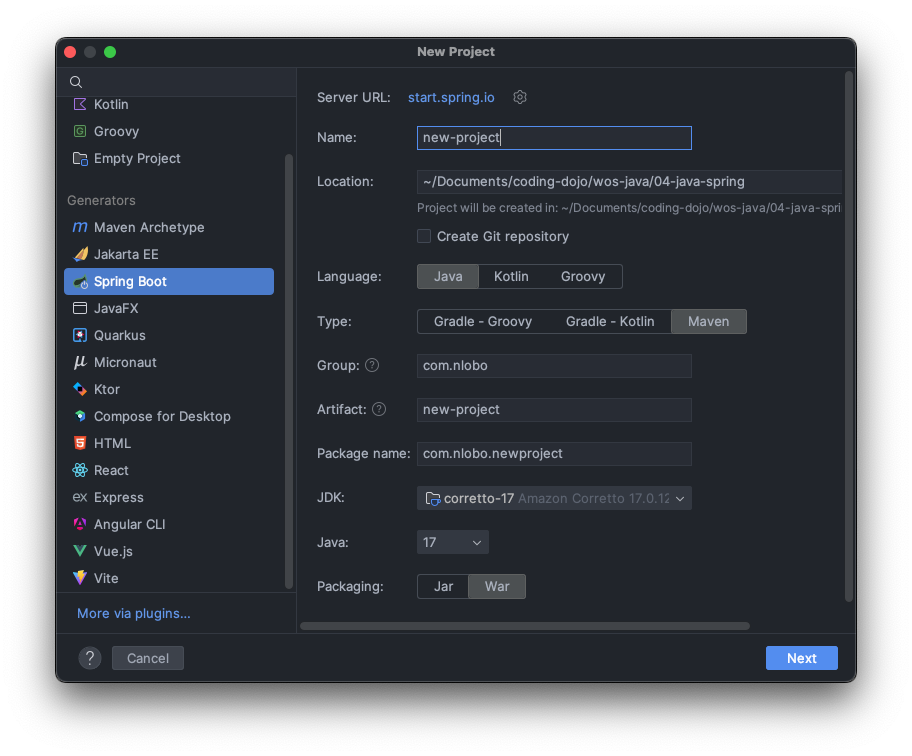

# Spring MVC Full-Stack, Step-by-Step
This is the process I take when creating a new full-stack, full CRUD Spring MVC project in IntelliJ.

## Create a New Project in IntelliJ
Use the File menu to create a new Spring Boot project. Be sure to choose Maven as your Type.


**Conventions:**
- Name: kebab-case (all lowercase with hyphens between each word, like `new-project`)
- Group: reverse domain name (like `com.nlobo`)
- Artifact: same as Name
- Package name: the group and the artifact together, without hyphens (`com.nlobo.newproject`)
- JDK: corretto-17 (Amazon Coretto 17)
- Java: 17
- Packaging: War

## Choose your dependencies:
The next dialog box allows us to add dependencies to the project. If you forget one, don't worry, you can always add/remove dependencies from the `pom.xml` file. We'll have to manually add some anyway.

Here are the ones we can choose in this dialog box:
- Spring Boot DevTools
- Spring Web
- Spring Data JPA
- MySQL Driver
- Validation

Once the project opens in IntelliJ, open the `pom.xml` file and add the following dependencies:

```xml
<!-- JSP Dependencies -->
<dependency>
    <groupId>org.apache.tomcat.embed</groupId>
    <artifactId>tomcat-embed-jasper</artifactId>
</dependency>
<dependency>
    <groupId>jakarta.servlet.jsp.jstl</groupId>
    <artifactId>jakarta.servlet.jsp.jstl-api</artifactId>
</dependency>
<dependency>
    <groupId>org.glassfish.web</groupId>
    <artifactId>jakarta.servlet.jsp.jstl</artifactId>
</dependency>

<!-- Bcrypt  -->
<dependency>
    <groupId>org.mindrot</groupId>
    <artifactId>jbcrypt</artifactId>
    <version>0.4</version>
</dependency>
```

**IMPORTANT:** Don't forget to load your maven changes! Click the Maven icon to open the Maven pane and click the refresh icon.

## Add Settings to `application.properties`
Open your `application.properties` file and paste in the following (don't delete what's already there):

```
# Where are jsp files? HERE!
spring.mvc.view.prefix=/WEB-INF/

# Data Persistence
spring.datasource.url=jdbc:mysql://localhost:3306/<<YOUR_SCHEMA>>?createDatabaseIfNotExist=true
spring.datasource.username=root
spring.datasource.password=root
spring.jpa.hibernate.ddl-auto=update

# For Update and Delete method hidden inputs
spring.mvc.hiddenmethod.filter.enabled=true
```

Change `<<YOUR_SCHEMA>>` to your new schema name. The convention is snake_case, ending in `db` or `schema` (like `burger_tracker_db` or `book_club_schema`). Don't forget to remove those angle brackets.

If you need to change your password, don't forget to change it.

## Bootstrap CSS and JS
Download these Bootstrap files and copy them to your static folder. Location should be: `src > main > resources > static`.

## Create your `WEB-INF` Folder
Create a new folder in the `main` directory named `webapp`. In the newly-created `webapp` folder, create another folder named `WEB-INF`.

## Create an `index.jsp` File
In the `WEB-INF` FOLDER, create a new file named `index.jsp`. This file will contain your login and register forms. Here's a starter template you can use (not including the forms):

```html
<%@ page language="java" contentType="text/html; charset=UTF-8" pageEncoding="UTF-8" %>
<%-- c:out ; c:forEach etc. --%>
<%@ taglib uri="http://java.sun.com/jsp/jstl/core" prefix="c" %>
<%-- Formatting (dates) --%>
<%@ taglib uri="http://java.sun.com/jsp/jstl/fmt" prefix="fmt" %>
<%-- form:form --%>
<%@ taglib uri="http://www.springframework.org/tags/form" prefix="form" %>
<%-- for rendering errors on PUT routes --%>
<%@ page isErrorPage="true" %>
<!DOCTYPE html>
<html lang="en" data-bs-theme="dark">
<head>
    <meta charset="UTF-8">
    <meta name="viewport" content="width=device-width, initial-scale=1.0">
    <link rel="stylesheet" href="/css/bootstrap.min.css"/>
    <title>Your Project</title>
</head>
<body>
<main class="container">
    <h1 class="display-4 mb-3">Login/Register Here</h1>
    
</main>
<script src="/js/bootstrap.bundle.min.js"></script>
</body>
</html>
```

## Create Your Models
Before you start the exam, you should already have a project with a functional login/register component. This component should consist of a `User` model, a `UserRepository`, a `UserService`, and a `UserController`. Make sure it's tested fully.